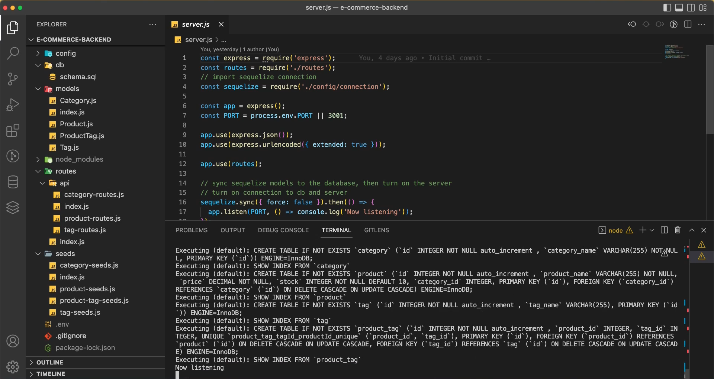
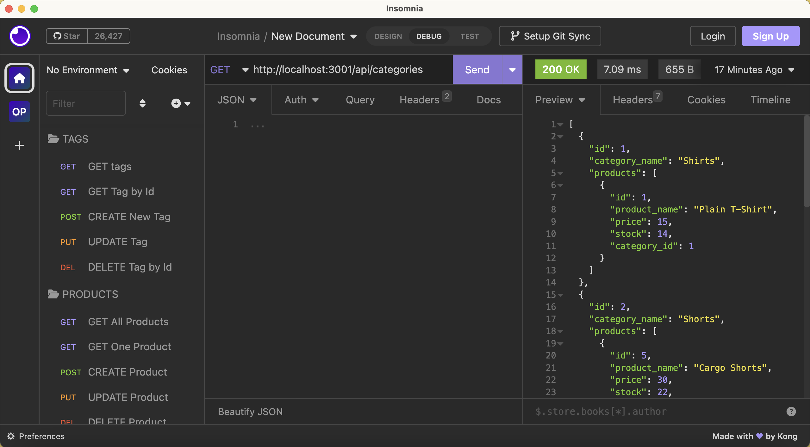

# E-commerce Back End
## Description
The e-commerce website's backend is created using Express.js API and Sequelize to connect with a MySQL database. Designed to manage data related to categories, products, and tags, it can be read, created, updated, and deleted. As this is a backend-only application, Insomnia was used to send requests to the APIs.

## Table of Contents
- [Description](#Description)
- [Installation](#Installation)
- [Usage](#Usage)
- [Questions](#Questions)
## Installation
1. Clone this repository.
```
git clone git@github.com:oliviasylee/e-commerce-backend.git
```

2. Run ‘npm install’ from the terminal at the root directory of the local repository to install the required packages.
```
npm install MySQL2 Sequelize dotenv
```

3. Create a .env file in the root of your project folder and add the following environment variables with the values for your database connection:
```
DB_USER=your_database_username
DB_PASSWORD=your_database_password
DB_NAME=your_database_name
```

4. In your terminal, run the command mysql -u root -p to connect to the database as the root user. After connecting, run the command source schema.sql to creates a database schema.
```
mysql -u root -p
```
```
source schema.sql
```

4. Run the application in your terminal:
```
node server.js
```
## Usage
### Video Walkthrough
Here is a full movie showing how the application works. [Click here](https://drive.google.com/file/d/1WcRb_u0YjH0qHKtDX2OJLCkE0BRcAFZM/view) <br>
[](https://drive.google.com/file/d/1WcRb_u0YjH0qHKtDX2OJLCkE0BRcAFZM/view)

[](https://github.com/oliviasylee/employee-tracker)

## Questions
If you have any questions about this projects, please contact me at oliviasylee@Gmail.com. You can view more of my projects at https://github.com/oliviasylee.